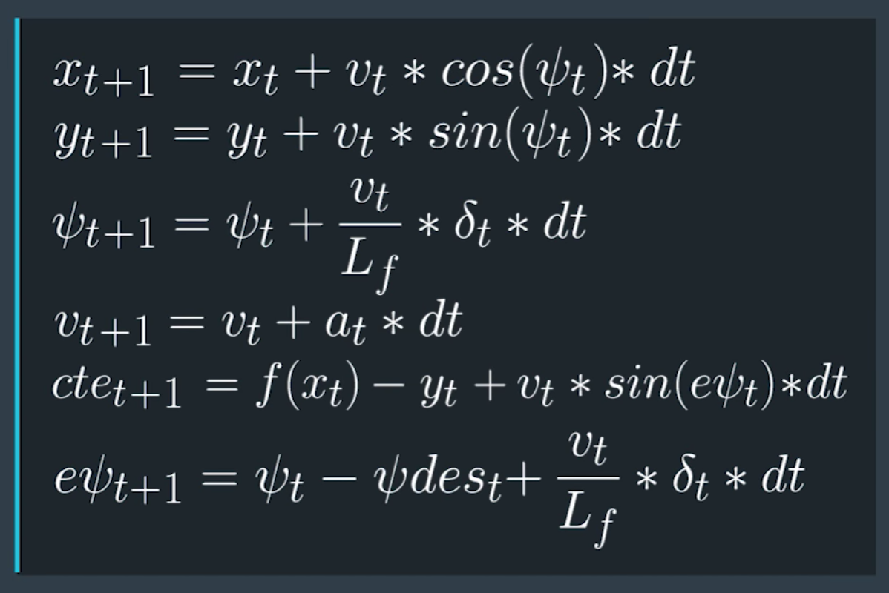

# Introduction

In this project we are supposed to use the kinematic model to come up with a model predictive controller to drive a car around the track. The simulator is going to provide us with waypoints (given in map coordinates) and initial state information. Using this initial information and our kinematic model we are to come up with a MPC controller.

## Kinematic MPC model



Our state at a partcular timestamp consists of

- x - position in x
- y - position in y
- psi - current orientation
- v - current speed
- cte - current cross track error
- epsi - error with the desired psi

The actuators we control are the delta (steering input) abd a (throttle/acceleration)

The model above captures the essence of how all this physical quantities depend on each other and how it changes over time.

## Timestep Length and Elapsed Duration (N & dt)

What we are essentially try to achieve is predict the state for the next T seconds with granularity of dt. Hence N = t/dt

I initially started with values on 25 and 0.05 for N and dt. However there was more delay due to computations. Also since there was a latency of 100ms it was a gut feel to set dt to .1 as it will be easier to adjust the actuations across different time steps. After tuning I cam down to N=15, and it was performing well enough over there.

## Polynomial Fitting and MPC Preprocessing

Polynomial fitting is required to come up with a reference path to follow. Using which we can determine/approxiamte our path over time. Simulator provides us with waypoints in map corrdinates. We transform this in the vehicle coordinates. Because that works better with our kinematic model, and is also easier to visualize later. 

Using a polynmomial of order 3 is sufficient to approximate the road curves.

## Model Predictive Control with Latency

Latency is an important concern in real world. To add thsi to our model I decided to use the actuation from a previous timestep to update the state at a later timestep.

```
/// code snippet from MPC.cpp
AD<double> delta0 = vars[delta_start + t - 1];
AD<double> a0 = vars[a_start + t - 1];

// 100 ms latency will cause a previous actuation to be observed later. By adding this we are changing our basic model to take in latency.
if (t > 1) {
  delta0 = vars[delta_start + t - 2];
  a0 = vars[a_start + t - 2];
}
```

## Cost parameters

```
// The part of the cost based on the reference state.
for (int t = 0; t < N; t++) {
  fg[0] += 3500*CppAD::pow(vars[cte_start + t], 2);
  fg[0] += 3500*CppAD::pow(vars[epsi_start + t], 2);
  fg[0] += CppAD::pow(vars[v_start + t] - ref_v, 2);
}

// Minimize the use of actuators.
for (int t = 0; t < N - 1; t++) {
  fg[0] += 30*CppAD::pow(vars[delta_start + t], 2);
  fg[0] += 30*CppAD::pow(vars[a_start + t], 2);
  fg[0] += 750*CppAD::pow(vars[delta_start + t]*vars[v_start + t], 2);
  fg[0] += 75*CppAD::pow(vars[delta_start + t]*vars[a_start + t], 2);
}

for (int t = 0; t < N - 2; t++) {
  fg[0] += 1000 * CppAD::pow(vars[delta_start + t + 1] - vars[delta_start + t], 2);
  fg[0] += 25 * CppAD::pow(vars[a_start + t + 1] - vars[a_start + t], 2);
}

```

Coming up with the above defined weights for different pieces of the cost equation was the most time consuming and intuitive part. It was mostly done using manual tuning, by first setting parameters and then observing the effect in the simulation.

## Final

It was a really fun projectand I have learnt a lot through the term 2. Looking forward for the next term. And also applying this in real world.
